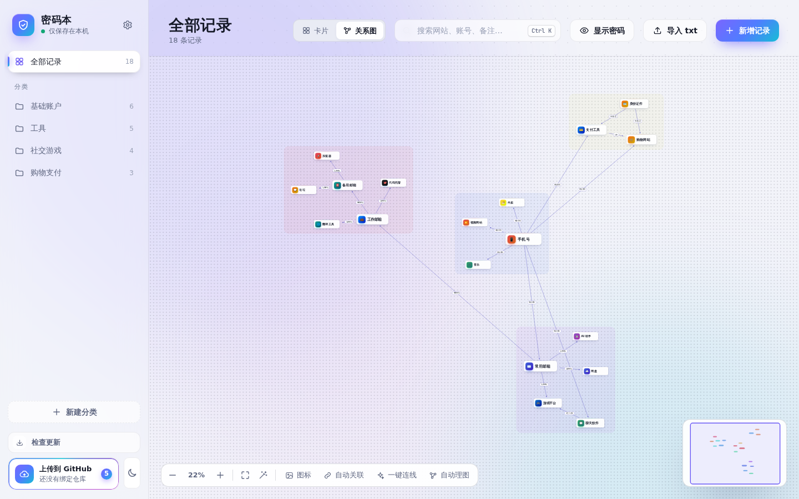
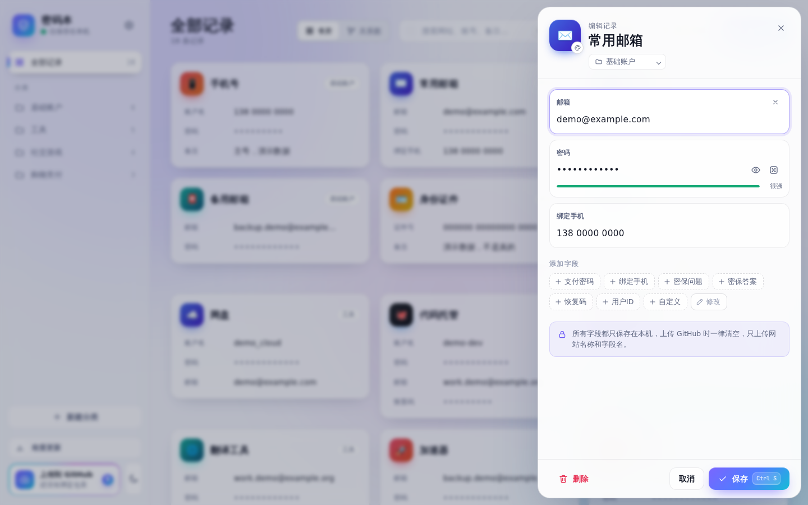
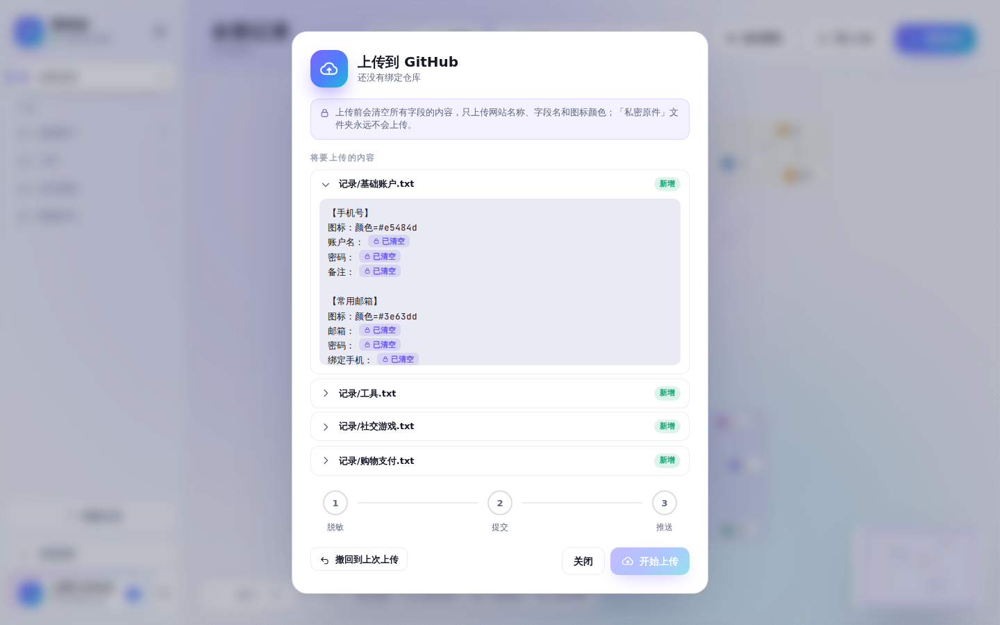

# 密码本 · 个人密码记录程序

在自己电脑上记录账号密码的小程序：卡片和关系图两种看法，能看出哪个账号绑了哪个邮箱、手机号。账号密码只保存在本机；想同步到 GitHub 时，所有字段一律清空，只同步网站列表和字段名。

> 截图里的名称、账号、密码全是演示用的假数据。

## 能做什么

- **卡片视图**：按分类浏览，一键显示 / 隐藏密码，搜索网站、账号、备注
- **关系图**：每条记录是一张卡片，拖线连起来写上关系（「注册邮箱」「绑定手机」……），一眼看出一个邮箱、一个手机号牵连着哪些账号
- **一键连线**：按卡片里相同的邮箱、手机号、账号自动连线，全在本机比对
- **自动理图**：互相连得多的卡片自动分成一组，每组一块淡色区域，各组围成一圈摆开；距离分小 / 中 / 大
- **导入 txt**：以前随手记的账号密码，格式随意，自动认出网站名、账号、密码、邮箱、手机号
- **安全**：账号密码只在本机；上传到 GitHub 前先预览，所有字段都清空，提交前还有安全检查拦着

| | |
|---|---|
|  |  |
| 卡片视图：按分类浏览，密码默认隐藏 | 编辑记录：字段可以随时加，密码强度一眼看到 |
|  |  |
| 自动理图：选距离，再选团在一块或分开摆 | 点一张卡片：只亮着它和跟它连着的 |
|  |  |
| 深色主题 | 上传到 GitHub 前的预览：所有字段都已清空 |

## 安装

### 方式一：安装程序（推荐）

到 [Releases](../../releases/latest) 下载 `mimaben-setup-版本号.exe`，双击安装：

- 装到你自己的用户目录，不用管理员权限；自带 Python，不用另外装
- 从开始菜单或桌面打开「密码本」
- 账号密码保存在安装目录里的 `私密原件` 文件夹，**请自己另外备份这个文件夹**（比如拷到 U 盘）
- 升级：程序里「检查更新」会提示有没有新版本，点「去下载」下载新的安装程序，装到原来的位置就行，记录不会动
- 卸载不会删掉 `私密原件`
- 安装版不带 GitHub 同步，数据只在这台电脑上；想同步看方式二
- Windows 可能提示「未知发布者」：点「更多信息」→「仍要运行」

### 方式二：用 git 同步（放进你自己的 GitHub 私有仓库）

想在几台电脑之间同步网站列表，或者想在 GitHub 上留一份脱敏后的清单时用。需要电脑上装好 [Python 3](https://www.python.org/downloads/) 和 [git](https://git-scm.com/downloads)。

1. 在 GitHub 上新建一个**私有**仓库（不要 Fork 公开仓库：Fork 出来的仓库是公开的，你的网站列表会被所有人看到）
2. 下载这个仓库的源代码，解压后推到你的私有仓库，再 `git clone` 到本机
3. 双击 `打开程序.bat`（第一次会自动安装窗口组件 pywebview）
4. 左下角「上传到 GitHub」：先预览脱敏后的内容，再依次执行脱敏、提交、推送；「检查更新」跟随你自己仓库的 `main`

| 位置 | 作用 | 会不会上传 |
|---|---|---|
| `私密原件/` | 放真实的 txt 记录 | **永不上传** |
| `记录/` | 程序自动生成的脱敏版本 | 上传 |
| `模板.txt` | 记录格式模板 | 上传 |
| `打开程序.bat` | 双击打开图形界面（第一次会自动安装窗口组件 pywebview） | — |
| `上传.bat` | 双击：脱敏 → 提交 → 推送（不开界面时用） | — |

## 用法

打开程序（安装版从开始菜单或桌面打开；用 git 同步的双击 `打开程序.bat`），在窗口里：

- 左侧按分类浏览，每个分类对应 `私密原件/` 里的一个 txt
- 「新增记录」按固定格式填写，可以随时添加「支付密码」「绑定手机」等字段；所有字段上传时都会清空
- 「添加字段」里的按钮可以自己改：点最后的「修改」（或设置里的「常用字段」），拖动排序、点 × 去掉、输入新字段回车添加，新增记录默认带哪些字段也在这里改；右键某个按钮可以直接去掉它
- 点编辑窗口左上角的图标，可以换颜色（预设色或自定义），也可以把首字母换成 emoji / 文字，或者换成图片：选本地图片、拖进来、Ctrl V 粘贴，或者点「联网查找」按网址和名称找网站图标、App Store 应用图标。联网查找只在点按钮时进行，不会发送账号密码
- 右上角「导入 txt」（或把 txt 直接拖进窗口）：把以前随手记的账号密码导进来。格式随意，比如「QQ 123456 密码」「微信----手机号----密码」、一段一个网站、`账号：xxx 密码：xxx`，程序会自动认出网站名、账号、密码、邮箱、手机号、网址，导入前可以预览、改名、取消勾选。UTF-8 和 GBK（记事本老格式）都能读
- 新建和导入的记录默认会自动联网找图标（网站大图标 > App Store 应用图标 > 网站小图标），只发送网站名称和网址；可以在设置里关掉，也可以一键给已有的记录补图标
- 右上角「卡片 / 关系图」切换显示方式（快捷键 `G`）。关系图里每条记录是一张小卡片，放在一张可以缩放、拖动的地图上：
  - 滚轮缩放，拖空白处移动，拖卡片摆位置；双击卡片编辑，右键有菜单；把卡片拖到左侧分类上就移到那个分类
  - 鼠标移到卡片上，右上角有个把手：拖它单独放大缩小这张卡片（40%～300%，以左下角为准），双击把手或右键「恢复原来大小」回到 100%
  - 按住卡片右边的小圆点拖到另一张卡片上，就连一条带箭头的线；点连线可以写关系（如「注册邮箱」「绑定手机」）、反转方向或删除，选中后按 `Delete` 也能删
  - 写关系时下面有快捷词，点一下就填上。快捷词可以改：点「修改」增删、拖动排序、双击改名，改名时可以把已有连线上的旧词一起换掉（能撤销）；输入了新词会出现「存为快捷词」；右键快捷词可以去掉
  - 「自动关联」：用了同一个邮箱、手机号或账号的记录，会经过一个小圆点用虚线连在一起，不用手动连
  - 「一键连线」（工具条里，或右键空白处）：不用一条条手画。程序在本机比对各卡片，认出同一个邮箱、手机号、账号是谁的（QQ 邮箱归 QQ、Gmail 归谷歌邮箱、手机号归运营商、证件号归身份证），从它连到用它的卡片，关系按那一栏的名字写（如「绑定手机」「辅助邮箱」）；看不出是谁的就不连。反过来，已经画好、写了关系的线，如果用的一方那一栏还空着，就从另一方抄过去（比如「身份证 → 支付宝：实名认证」会把证件号填进支付宝的「实名认证」）。先预览（号码只露头尾几位），勾选的才改；会换掉原有内容的默认不勾
  - 一键连线连错了：再点「一键连线」，左下角「撤回上次一键连线」（或右键空白处），把那次加的线、补的关系说明和卡片内容改回去。关掉程序再打开也能撤，可以连续往回撤（记最近 20 次，存在 `私密原件/一键连线.json`，不上传）；那次之后你手动改过的线和栏不会动。每次应用前还会把整个 `私密原件/` 打包成「连线前」备份，在「备份」里能整体恢复
  - 左下角工具条：缩放、显示全部（`0`）、自动排列（同分类聚在一起，连了线的互相靠近）；右下角小地图点一下就跳过去
  - 「自动理图」（工具条里，或右键空白处）：按连线把卡片重新摆一遍，位置和大小都能撤销。先选卡片之间的距离（小 / 中 / 大，会记住），再选摆法：
    - 互相连得多的卡片自动分成一组（比如一个邮箱和用它注册的那些网站；几张互相连着的卡片，像支付、购物、证件，也会自成一组），每组挨在一起，背后有一块淡淡的底色，一眼分得清
    - 各组围成一圈：跟大多数组都连着的那组在中间，互相连着的组在圈上挨着，组和组之间空出一圈
    - 团在一块：圈尽量小；分开摆：圈更大，跟中间那组连得少的组再靠外一点，看得清是谁连着谁
    - 连线多的卡片稍微放大一点（最多 1.4 倍）；一条线都没连的卡片排成一小块格子
    - 「自动排列」会去掉这些底色
  - 工具条里的「图标」：单独调关系图里的图标大小（50%～300%，在设置里的大小上再放大缩小，卡片视图不受影响），关系图里快捷键 `[` / `]` 也是调这个；图标变大后叠在一起的卡片会自动推开
  - 左侧选分类、搜索、点选一张卡片时，其他卡片变淡，左上角会写明原因，点旁边的按钮（看全部 / 清除搜索 / 取消选中）就恢复；搜索框里按回车会对准找到的卡片
  - 右上角「显示密码」和快捷键 `H` 在关系图里也能用（只显示当前没变淡的卡片），每行密码旁边也有小眼睛单独显示
  - 卡片位置和连线存在 `私密原件/关系图.json`，不上传；记录改名、换分类后连线会跟着走（直接手改 txt 里的名称，那条记录的连线会对不上）
- 左下角「上传到 GitHub」（用 git 同步时）会先预览脱敏后的内容，再依次执行脱敏、提交、推送
- 每次上传成功后，会把整个 `私密原件/`（记录、关系图、图标）打包存一份「上传时」备份（和上一份一样就不重复存，保留最近 10 份）。上传窗口左下角或设置里的「撤回到上次上传」：先列出上传之后改了哪些分类、哪几条记录（只列名称，不显示账号密码），确认后本机数据回到上次上传时的样子；撤回前会自动另存一份「恢复前」备份，提示条上点「撤销」就能改回来。GitHub 上的内容不受影响
- 「上传到 GitHub」上面的「检查更新」：安装版会看 GitHub 上有没有发布新版本，有的话点「去下载」打开下载页。用 git 同步的会从 GitHub 拉取程序的新版本：每次打开程序时自动检查一次，有更新会提示；点「立即更新」后自动重启。只更新程序文件和 `记录/`，`私密原件/` 不会动；如果本机有还没推送的记录，会接在新版本后面，有冲突就放弃更新、保持原样。每次更新前会自动把整个 `私密原件/` 打包备份到 `私密原件/.备份/更新前-时间.zip`（保留最近 10 份）；新版本出问题时，在更新窗口或「已是最新」提示里点「更新前备份」，可以一键恢复（恢复前会先把当前数据另存一份「恢复前」备份）

窗口用 pywebview（系统自带的 WebView2）打开，标题栏颜色跟着深色 / 浅色主题变。没装 pywebview 时，程序会先用 Edge 的应用窗口打开，同时在后台自动 `pip install pywebview`（要联网），装好后自动换成新窗口、关掉旧窗口，不用手动操作。装不上时继续用 Edge 窗口，功能一样，只是标题栏颜色跟着 Windows 设置走；原因会写进 `%LOCALAPPDATA%\个人密码记录程序\错误日志.txt`。

左上角齿轮是「设置」：可以调图标大小（60%～200%，卡片和关系图里的图标一起变，快捷键 `[` 缩小、`]` 放大），切换浅色 / 深色主题，以及 8 种字体（系统默认、思源黑体·细、报刊衬线、思源宋体、霞鹜文楷、站酷小薇、毛笔、等宽），还可以让按钮、菜单等界面文字也用选中的字体。字体文件都在 `tools/web/fonts/`（SIL OFL 开源字体），不用联网。设置保存在 `%LOCALAPPDATA%\个人密码记录程序\设置.json`。

快捷键：`N` 新增，`H` 显示 / 隐藏当前页所有密码（显示的 60 秒后自动隐藏），`G` 切换卡片 / 关系图，`[` / `]` 缩小 / 放大图标（关系图里只调关系图的），`Ctrl K` 或 `/` 搜索，`Ctrl S` 保存，`Esc` 关闭。关系图里：`+` / `-` 缩放，`0` 显示全部，`Delete` 删除选中的连线。

用 git 同步的也可以不开界面：直接按 `模板.txt` 的格式编辑 `私密原件/` 里的 txt，再双击 `上传.bat`。

图标设置保存在 txt 里每条记录的「图标：」一栏（例如 `图标：颜色=#34c759 文字=🐧`）。上传时这一栏只保留颜色和图片文件名，自己输入的 emoji / 文字不上传；图标图片本身存在 `私密原件/图标/`，不会上传。

每次保存前，旧文件会自动备份到 `私密原件/.备份/`（每个分类保留最近 30 份）；删除的分类也会移到这里。

## 注意

- GitHub 上**没有**账号和密码的备份，真正的数据只在 `私密原件/`。请另外备份这个文件夹，比如拷到 U 盘。
- 上传时所有字段（包括网址、备注）都会清空，`#` 开头的注释和没有字段名的整行文字也会去掉。GitHub 上只有网站名称、字段名和图标颜色。
- 上传前会自动做安全检查（程序里的「上传到 GitHub」和 `上传.bat` 都会做；装了 `.githooks/pre-commit` 的话手动 `git commit` 也会做）：如果发现任何字段有内容、有多余的文字、有图片或文档（只有 `docs/图片/` 里说明用的截图例外）、或有 `私密原件/` 下的文件被提交，就会拦下这次提交。

## 许可

程序代码用 [MIT 许可](LICENSE)；`tools/web/fonts/` 里的字体各自用 SIL OFL 开源字体许可。
